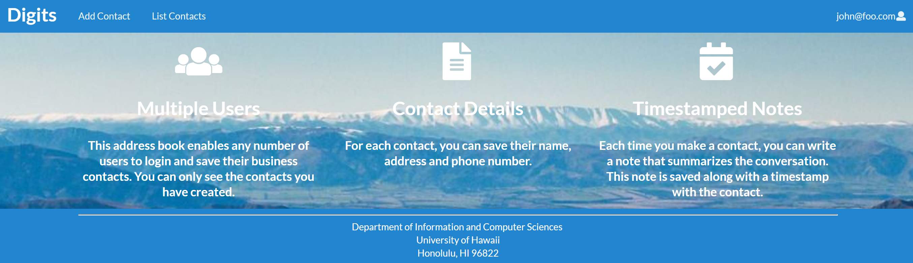
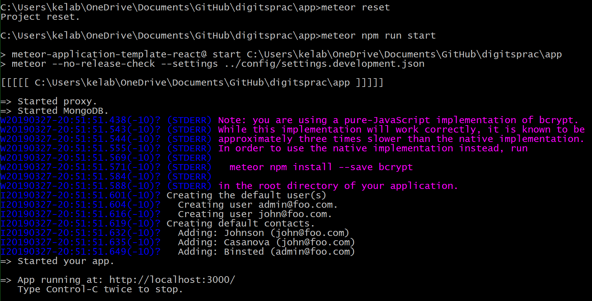
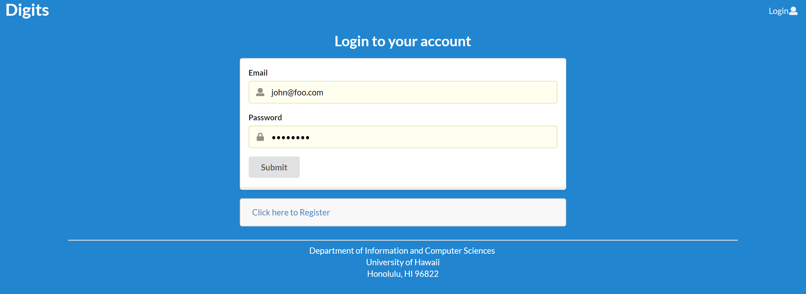
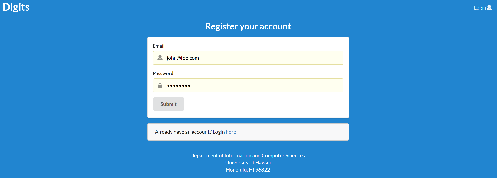
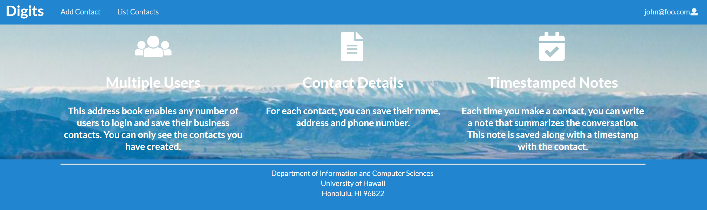
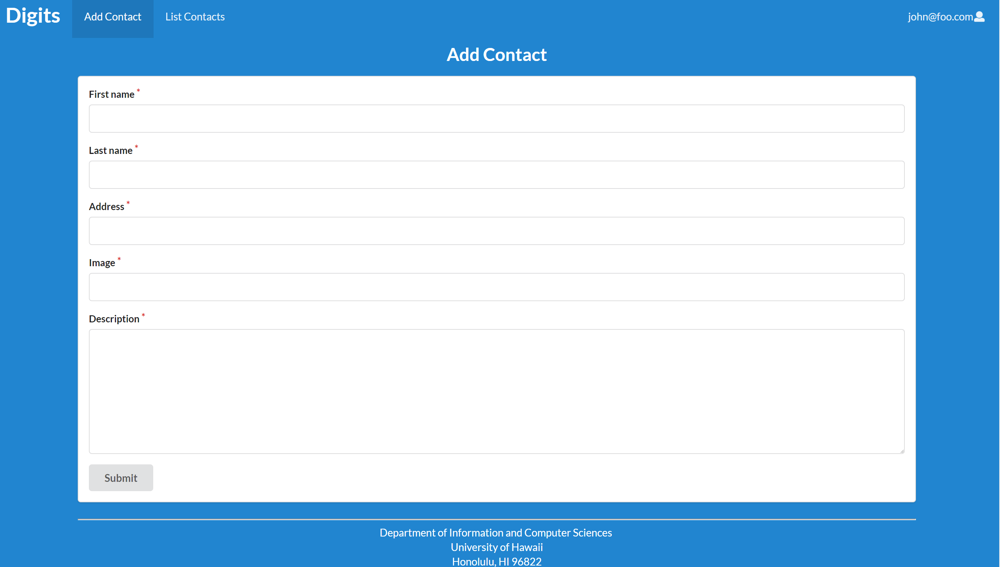
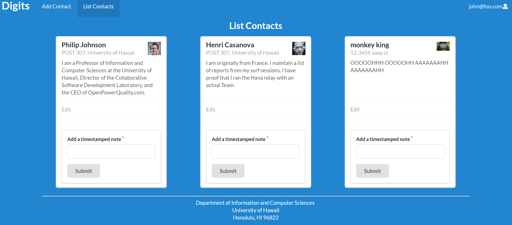
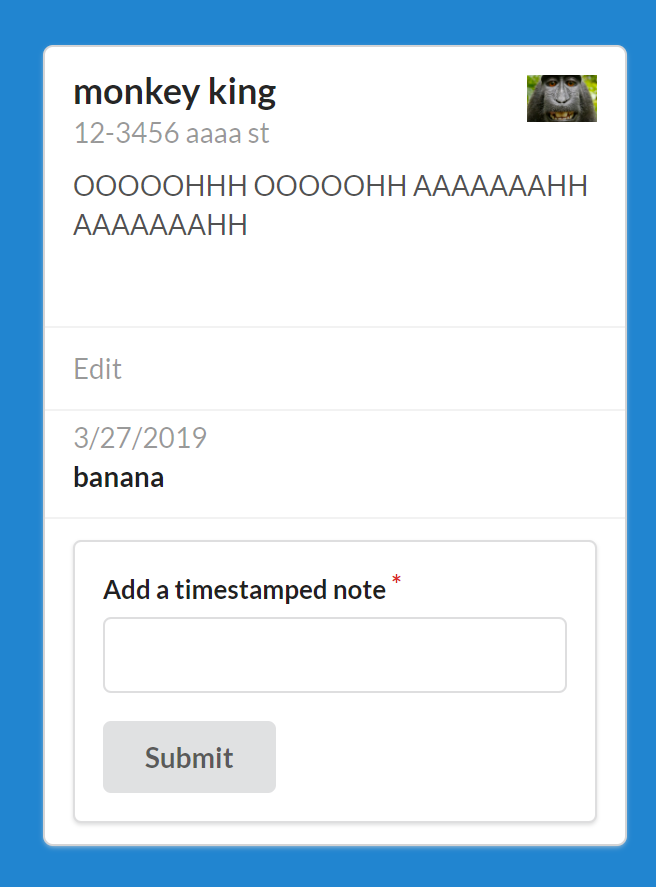
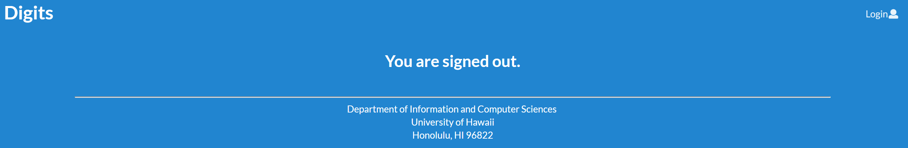
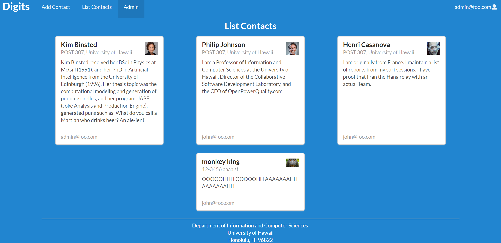

# Digits Meteor Application
## Digits Capabilities
Allows users to:
- Register/login to an account
- Add/edit contacts
- Add timestamped notes to a contact



## Application Installation Instructions
1. Install [Meteor](https://www.meteor.com/install)

2. Download a copy of Digits from my [repo](https://github.com/victoria-soto/digits2)

3. Open a command prompt and cd into the app directory of the Digits repo you downloaded and type: 
    ```sh
    $ meteor npm install
    ```

4. After the necessary packages have been downloaded, type:
    ```sh
    $ meteor npm run start
    ```
    
5. When the application successfully runs, your command prompt window should look similar to the image below:


6. Open a browser and go to [http://localhost:3000/](http://localhost:3000/) to interact with the Digits application.

7. You may use the default account data below or register a new account to login and get started:
    ```
   "defaultAccounts": [
       {
         "email": "admin@foo.com",
         "password": "changeme",
         "role": "admin"
       },
       
       {
         "email": "john@foo.com",
         "password": "changeme"
       }
     ],
    ```

## Digits Application Walkthrough
    
### Landing page

When you first open the Digits application you'll see the landing or homepage which describes the application's capabilities as seen below:


### Login
You may login as a member of a default account outlined in Step 7 above or register for your own account.
 
 
### Register
If you'd like to start the application from scratch, you may register an account.

  
  
### User Home Page
After login in, you may click on the Digits tab on the upper right corner to be directed to the user homepage where you may select Add Contact or List Contacts.


### Add Contact
Since you've just registered your account, click on the Add Contacts tab to add a new contact. A green banner will appear at the top of the screen indicating that the contact was added successfully.
 
  
### List Contacts
 After adding a new contact, you may view your contacts list under the List Contacts tab. Here you may choose to edit your contact's information or add a timestamped note.
 

### Timestamped Note
 While in the List Contacts tab, you may add a note about your friend and view it upon pressing the submit button.
  
  
### Logging out
 After you've added all of your contacts and timestamped notes, you can logout of your account by selecting your email on the top right corner, followed by selecting the Sign Out button. You'll see a message indicating that you've logged out.
 

### Admin Mode
 While logged in as an administrator, you get special access to the Admin tab which shows all the contacts and the users they're associated with in the Digits application database.
 
  
### Application Reset
You may choose to keep the default data and the additional contacts you've added when registering for a new account. However, if you'd like to wipe out any newly added data, you can do so by typing:
```sh
$ meteor reset
$ meteor npm run start
```
